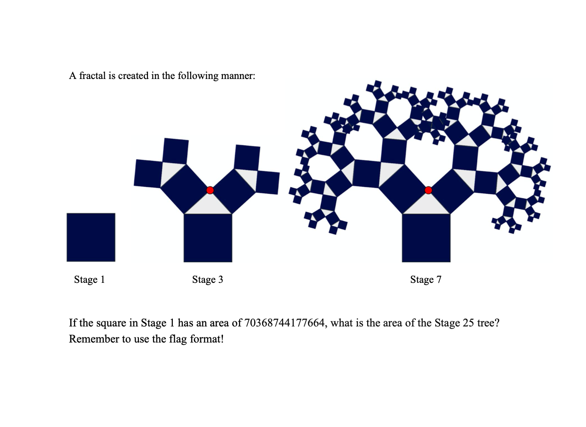
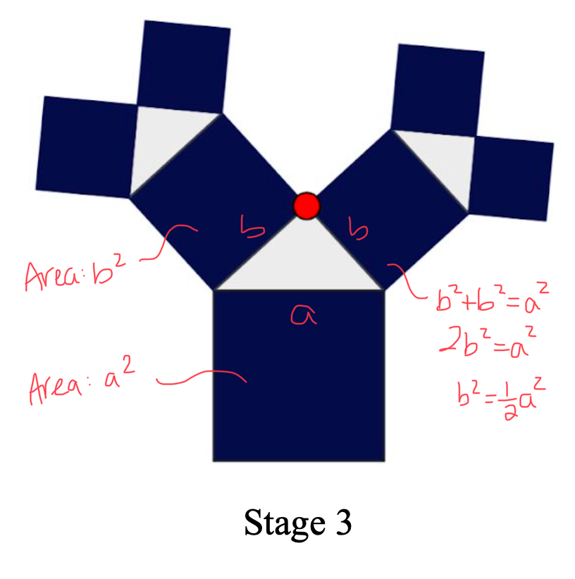

# Pythagorean Tree Fractal 2
## Problem

Author: Plate_of_Sunshine

## Solution
The area of each new square in each stage halves from the parent square. This can be shown as so:  
  

So, to calculate the flag, it's (the area of the first square * number of stages).

Flag: `flag{1759218604441600}`
