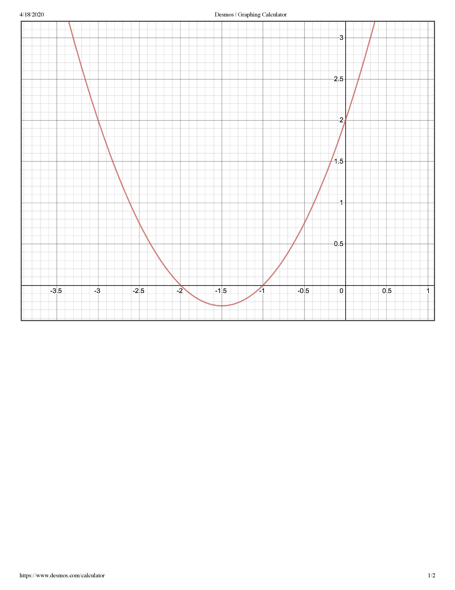

# Affina and the Quadratics
## Problem
Affina was struggling with her graphing quadratics homework. Bored, she decided to cheat by using Desmos to graph the given quadratic, and then realized that she could use it to send messages to her best friend without anyone noticing!

Note: Affina uses a 26 character charset and the numbers are encoded differently.

Affina_and_the_Quadratics.txt:
```
Affina was struggling with her graphing quadratics homework. Bored, she decided to cheat by using Desmos to graph the given quadratic, and then realized that she could use it to send messages to her best friend without anyone noticing!

She sent the following message to her friend: 7rr4p6_4e_4ph6bo8hap2?

Can you decrypt it using the image of the quadratic Affina used? Note: the flag should make relative sense.
```



Author: Plate_of_Sunshine
## Solution