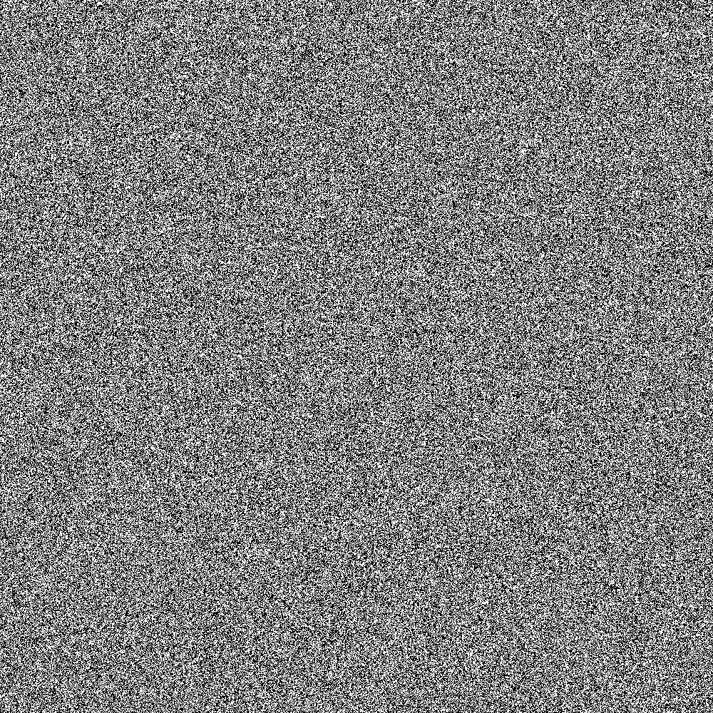

# Binary Word Search
## Problem
My little brother who is in kindergarten was given this to him by his teacher. He wasn't able to solve it, but can you?

Note: 0 is black, 1 is white. The entire flag is hidden inside the word search, including flag{}. The flag may also be backwards or diagonally hidden.

Author: AC
## Solution
Starting off, I wrote code to read each pixel to convert the entire image to its binary representation. ([reader.html](./reader.html), [reader.js](./reader.js)).

Then, in Python, I check every row, column, and diagonal for the string `flag{` in binary representation. I slice the beginning part of that and convert to ASCII ([checker.py](./checker.py)).

Flag: `flag{tinyurl.com/y9fskyh6}`