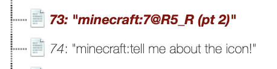

## Bored Out of my Mined
# Problem
This top Notch challenge will craft some difficulty for some.

DM @JC01010 on discord if you have issues concatenating the flag.

*You do not need the the game for this challenge*

[Zipped Minecraft save](./hsctfn0t_tH7_3a5y-20200531T210434Z-001.zip)

Author: JC01010

# Solution
In the files, we can start off looking at the latest.log file. Here, we see Herobrine giving us part 1 of the flag as well as clue to part 2:
```
[2:16:52] [Server thread/INFO]: <Herobrine> pt 1: flag{d0_5
[2:16:52] [Server thread/INFO]: <Herobrine> Tell me about myself!
```

This hint leads us to his player data, in ./playerdata/{uuid}.dat. As this is a Minecraft save, .dat data is stored in NBT format. This NBT format can be read through an NBT reader, like [webNBT](https://irath96.github.io/webNBT/) or [NBTExplorer](https://github.com/jaquadro/NBTExplorer). Here, in his discovered recipes (recipeBook > recipes > 73), is part 2 of the flag and the clue to part 3.


This hint leads us to look at the icon, icon.png. By opening this file in a text editor and looking at the end of the file, XML data can be found.
```xml
    <?xpacket begin='' id='W5M0MpCehiHzreSzNTczkc9d'?>
    <x:xmpmeta xmlns:x='adobe:ns:meta/' x:xmptk='Image::ExifTool 10.40'>
    <rdf:RDF xmlns:rdf='http://www.w3.org/1999/02/22-rdf-syntax-ns#'>

    <rdf:Description rdf:about=''
    xmlns:Iptc4xmpCore='http://iptc.org/std/Iptc4xmpCore/1.0/xmlns/'>
    <Iptc4xmpCore:Location>kfdlak</Iptc4xmpCore:Location>
    </rdf:Description>

    <rdf:Description rdf:about=''
    xmlns:dc='http://purl.org/dc/elements/1.1/'>
    <dc:creator>
    <rdf:Seq>
        <rdf:li>jfadklfjk</rdf:li>
    </rdf:Seq>
    </dc:creator>
    <dc:description>
    <rdf:Alt>
        <rdf:li xml:lang='x-default'>cHQgMzogMFRhdDM/XyA=</rdf:li>
    </rdf:Alt>
    </dc:description>
    <dc:rights>
    <rdf:Alt>
        <rdf:li xml:lang='x-default'>djsakjdfskljklj</rdf:li>
    </rdf:Alt>
    </dc:rights>
    <dc:title>
    <rdf:Alt>
        <rdf:li xml:lang='x-default'>jkfldsajlkfdskjo</rdf:li>
    </rdf:Alt>
    </dc:title>
    </rdf:Description>

    <rdf:Description rdf:about=''
    xmlns:xmp='http://ns.adobe.com/xap/1.0/'>
    <xmp:Label>Finally, tell me about the level - perhaps, the command length?</xmp:Label>
    <xmp:Rating>9423</xmp:Rating>
    </rdf:Description>
    </rdf:RDF>
    </x:xmpmeta>
    <?xpacket end='r'?>
```
Really, most of this is gibberish, except for `cHQgMzogMFRhdDM/XyA=` and `Finally, tell me about the level - perhaps, the command length?`. The first is part 3 in Base64 representation (decoded: `pt 3: 0Tat3?_`), and the second gives the clue to part 4.

This finally leads us to level.dat, where in Data > GameRules > maxCommandChainLength, there is an abnormally long string of numbers (`11211652581215153161125`). In a decimal conversion to ASCII, values are between around 32 and 127. So, we can split the string like so: `112 116 52 58 121 51 53 161 125` and convert to ASCII (with an inverted exclamation mark too for some reason).

Flag: `flag{d0_57@R5_R0Tat3?_y35¡}`

# Additional Clue
There is an additional hidden clue (albeit kind of useless), found in Herobrine's inventory. In his inventory, we see that he has 11 blocks: `minecraft:spawner`, `minecraft:dead_bush`, `minecraft:nether_bricks`, `minecraft:infested_stone`, `minecraft:nether_brick_stairs`, `minecraft:enchanting_table`, `minecraft:dead_bush`, `minecraft:glass_pane`, `minecraft:brick_stairs`, `minecraft:infested_stone`, `minecraft:melon`. 

As this Minecraft save file is in 1.15.2, the items are stored with their namespaced ID, which replaced numeric IDs in [The Flattening of Minecraft 1.13](https://minecraft.gamepedia.com/1.13/Flattening). The numeric IDs can still be found online, so by converting each block to their old numeric ID, you get `52 32 112 97 114 116 32 102 108 97 103`, which when converted to ASCII is `4 part flag`.