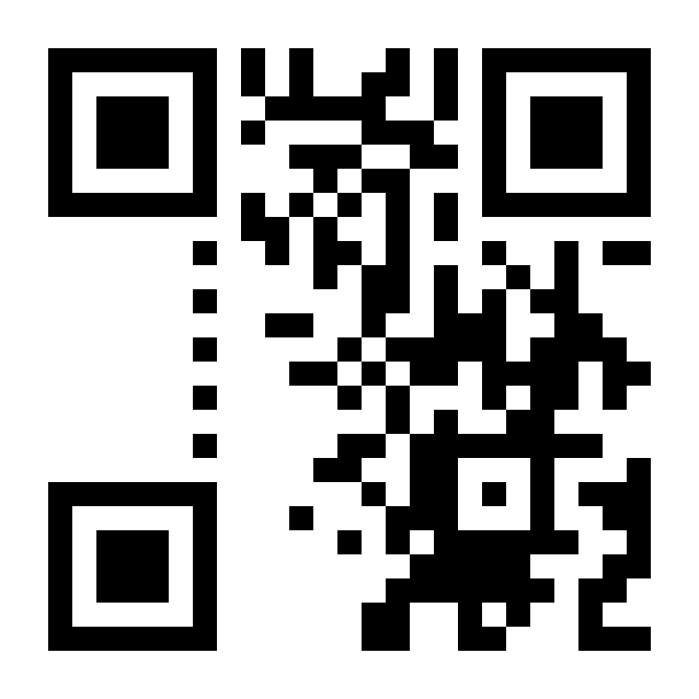
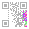

# N-95
## Problem
QR codes wear masks and so should you.


Author: AC

## Solution
As evidenced by the challenge description, this challenge is about [QR codes](https://en.wikipedia.org/wiki/QR_code). The Wikipedia page for QR codes has plenty of information on [encoding](https://en.wikipedia.org/wiki/QR_code#Encoding) and [decoding](https://en.wikipedia.org/wiki/QR_code#Decoding_example) a QR code. They explain it much better than I can.

Most but not all of the QR code can be recovered by filling in partially covered pixels and adding the shape of the corners.  


While we don't have the left side of the QR code, this recovered QR is *almost* enough to recover all the data, because in a QR code, the QR code data is stored on the right side of a QR code (The left side is used to store data to help fix errors if the right side is obscured).

So how do we recover the data? Well, a QR code is saved in 8-bit chunks, which can be converted to binary. These blocks start from the bottom-right and move up and left, like depicted below.  
  
(Note that D1 is a 4-bit long 2x2 square, instead of an 8-bit chunk.)

These chunks can be converted to binary by mapping each bit to its correct position, marked below.


A QR code starts with the 4 bits designating the encoding (which in this case is byte encoding aka 0100), then a length, then the rest of the data.


QR codes also apply an "XOR mask" to the data before it's displayed, so we cannot directly convert the displayed bits into binary. First, we would need to determine the XOR mask. Unfortunately, the bits that normally designate which XOR mask to use were obscured, so we need to manually find the mask. To do this, we first need to use the bits that we know the information to. This would be the bits in the byte encoding, as well as the bits encoding `flag{`.


Here, 7 of the chunks are labeled with the data they represent. We can grab the data of these chunks:
```
       cod  len      f        l        a        g        {
       1100 01111011 11100000 01110100 00001101 01011111 01010011
```

Finally, comparing them with their actual values, we can find the XOR mask.
```
       cod  len      f        l        a        g        {
       1100 01111011 11100000 01110100 00001101 01011111 01010011
actual 0100 ???????? 01100110 01101100 01100001 01100111 01111011
   xor 1000 ???????? 10000110 00011000 01101100 00111000 00101000
```
  
(Mask remapped to position on QR code)

Now that we have the mask, we can continue reading through the QR code and use the XOR mask to convert the display bits into their correct corresponding value. Two chunks at the end do have 1 or 2 missing bits, but their bits can be determined by context.

Again, do read for better understanding on the Wikipedia page: [QR_code#Encoding](https://en.wikipedia.org/wiki/QR_code#Encoding), [QR_code#Decoding_example](https://en.wikipedia.org/wiki/QR_code#Decoding_example)

Flag: `flag{60_dozen_quartz_jars}`