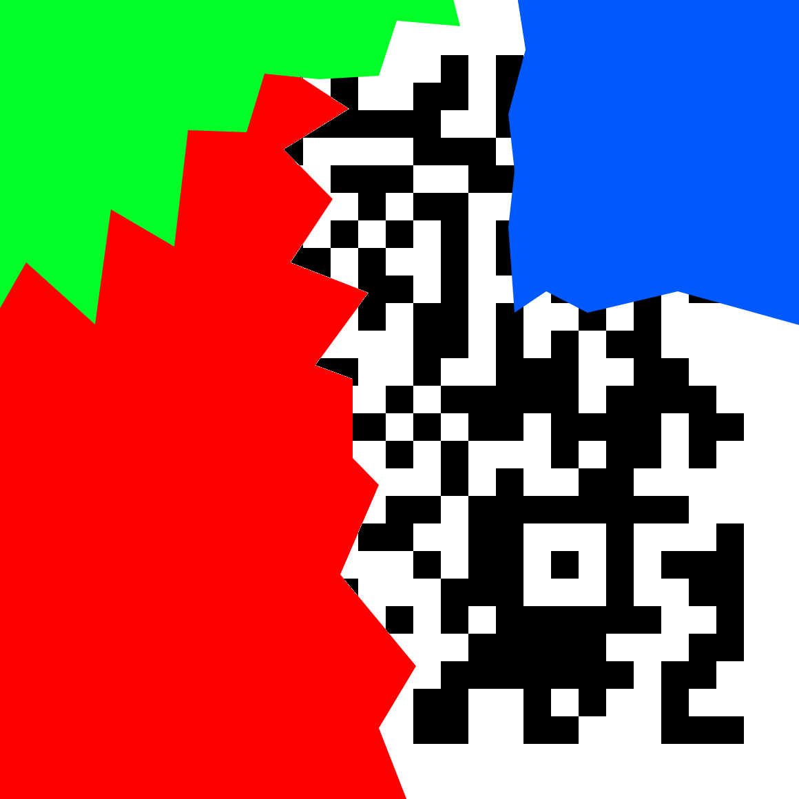

# N-95
## Problem
QR codes wear masks and so should you.

Author: AC

## Solution
Most but not all of the QR code can be recovered by filling in partially covered pixels and adding the shape of the corners.  
