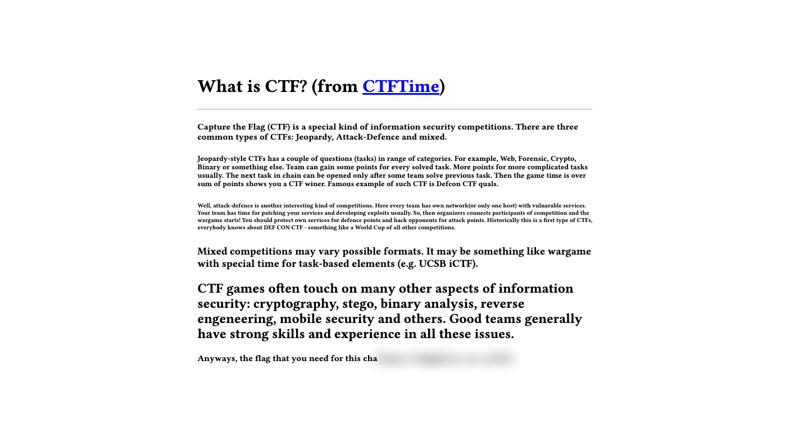

# Blurry Eyes
## Problem
I can't see :(

Author: meow

## Solution
Using the Developer Tools (or Inspect Element), it can be seen that there is a `class=blur` attribute located on an element surrounding the blurred text. So, to remove the blur, remove the attribute.

Flag: `flag{glasses_are_useful}`